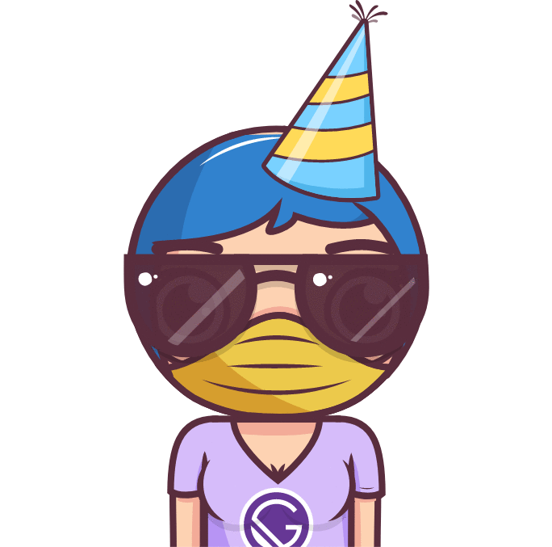

<p align="center" >
  
</p>

### Try it

### Getting Started

1. Clone the repo
2. npm install
3. tsdx build
4. copy dist folder in project

then, in your app:

```jsx
import { BigHead } from 'dist/index'

const Example = () => (
  <BigHead
    accessory="shades"
    body="chest"
    bgColor="blue"
    clothing="tankTop"
    clothingColor="black"
    eyebrows="angry"
    eyes="wink"
    facialHair="mediumBeard"
    graphic="vue"
    hair="short"
    hairColor="black"
    hat="none"
    hatColor="green"
    lashes="false"
    lipColor="purple"
    showBackground={true}
    faceMask={true}
    mouth="open"
    skinTone="brown"
  />
)
```

### Props

- [`accessory`](#accessory)
- [`body`](#body)
- [`bgColor`](#bgcolor)
- [`bgShape`](#bgshape)
- [`clothing`](#clothing)
- [`clothingColor`](#clothingcolor)
- [`eyebrows`](#eyebrows)
- [`eyes`](#eyes)
- [`facialHair`](#facialhair)
- [`graphic`](#graphic)
- [`hair`](#hair)
- [`hairColor`](#haircolor)
- [`hat`](#hat)
- [`hatColor`](#hatcolor)
- [`lashes`](#lashes)
- [`lipColor`](#lipcolor)
- [`mask`](#mask)
- [`faceMask`](#faceMask)
- [`mouth`](#mouth)
- [`skinTone`](#skinTone)

# Reference

## Props

### `accessory`

Type of accessory

| Type     | Required | Default |
| -------- | -------- | ------- |
| enum('none', 'roundGlasses', 'tinyGlasses', 'shades', 'hoopEarrings') | No       | Random |

---

### `bgColor`

The color of the background

| Type     | Required | Default |
| -------- | -------- | ------- |
| enum('blue', 'green', 'red', 'none', 'transparent') | No       | Random |

---

### `bgShape`

The shape of the background

| Type     | Required | Default |
| -------- | -------- | ------- |
| enum('circle', 'square', 'squircle') | No       | Random |

---

### `body`

Type of body

| Type     | Required | Default |
| -------- | -------- | ------- |
| enum('chest', 'breasts') | No | Random |

---

### `clothing`

Type of cloth

| Type     | Required | Default |
| -------- | -------- | ------- |
| enum('naked', 'shirt', 'dressShirt', 'vneck', 'tankTop', 'dress', 'denimJacket', 'hoodie', 'chequeredShirt', 'chequeredShirtDark') | No       | Random |

---

### `clothingColor`

The color of the clothes

| Type     | Required | Default |
| -------- | -------- | ------- |
| enum('white', 'blue', 'black', 'green', 'red') | No       | Random |

---

### `eyebrows`

Type of eyebrows

| Type     | Required | Default |
| -------- | -------- | ------- |
| enum('raised', 'leftLowered', 'serious', 'angry', 'concerned') | No       | Random |

---

### `eyes`

Type of eyes

| Type     | Required | Default |
| -------- | -------- | ------- |
| enum('normal', 'leftTwitch', 'happy', 'content', 'squint', 'simple', 'dizzy', 'wink', 'heart', 'crazy', 'cute', 'dollars', 'stars', 'cyborg', 'simplePatch', 'piratePatch') | No       | Random |

---

### `facialHair`

Type of facial hair

| Type     | Required | Default |
| -------- | -------- | ------- |
| enum('none', 'stubble', 'mediumBeard', 'goatee') | No       | Random |

---

### `graphic`

Type of graphic over the t-shirts

| Type     | Required | Default |
| -------- | -------- | ------- |
| enum('none', 'redwood', 'gatsby', 'vue', 'react', 'graphQL', 'donut', 'rainbow') | No       | Random |

---

### `hair`

Type of hair

| Type     | Required | Default |
| -------- | -------- | ------- |
| enum('none', 'long', 'bun', 'short', 'pixie', 'balding', 'buzz', 'afro', 'bob', 'mohawk') | No       | Random |

---

### `hairColor`

The color of the hair

| Type     | Required | Default |
| -------- | -------- | ------- |
| enum('blonde', 'orange', 'black', 'white', 'brown', 'blue', 'pink') | No       | Random |

----

### `hat`

Type of hat

| Type     | Required | Default |
| -------- | -------- | ------- |
| enum('none', 'beanie', 'turban', 'party', 'hijab') | No       | Random |

---

### `hatColor`

The color of the hat

| Type     | Required | Default |
| -------- | -------- | ------- |
| enum('white', 'blue', 'black', 'green', 'red') | No       | Random |

---

### `lashes`

Show lashes

| Type     | Required | Default |
| -------- | -------- | ------- |
| boolean  | No       | Random  |

---

### `lipColor`

The color of the lips

| Type     | Required | Default |
| -------- | -------- | ------- |
| enum('red', 'purple', 'pink', 'turqoise', 'green') | No       | Random |

---

### `mouth`

Type of mouth

| Type     | Required | Default |
| -------- | -------- | ------- |
| enum('grin', 'sad', 'openSmile', 'lips', 'open', 'serious', 'tongue', 'piercedTongue', 'vomitingRainbow') | No       | Random |

---

### `skinTone`

The color of the skin

| Type     | Required | Default |
| -------- | -------- | ------- |
| enum('light', 'yellow', 'brown', 'dark', 'red', 'black') | No       | Random |

### `showBackground`

If set to true it displays the avatar in a circle and cuts off everything below it. If set to false, it won't display the circle, and won't clip off any of the avatar.

| Type     | Required | Default |
| -------- | -------- | ------- |
| boolean  | No       | Random  |

### `faceMask`

If set to true the avatar will be wearing a face mask

| Type     | Required | Default |
| -------- | -------- | ------- |
| boolean  | No       | Random  |

### `faceMaskColor`

The color of the face mask

| Type     | Required | Default |
| -------- | -------- | ------- |
| enum('white', 'blue', 'black', 'green', 'red') | No       | Random |

---

# Authors
- Some portions of this code belong to the [Big Heads authors](https://github.com/RobertBroersma/bigheads) which are distributed under the [MIT License](https://github.com/RobertBroersma/bigheads/blob/main/LICENSE)
- Some portions of this code belong to the [react-native-bigheads authors] which are distributed under the [MIT License](https://github.com/felipecespedes/react-native-bigheads/blob/master/LICENSE)
- Robert Linde

# License
This project is licensed under the MIT License
